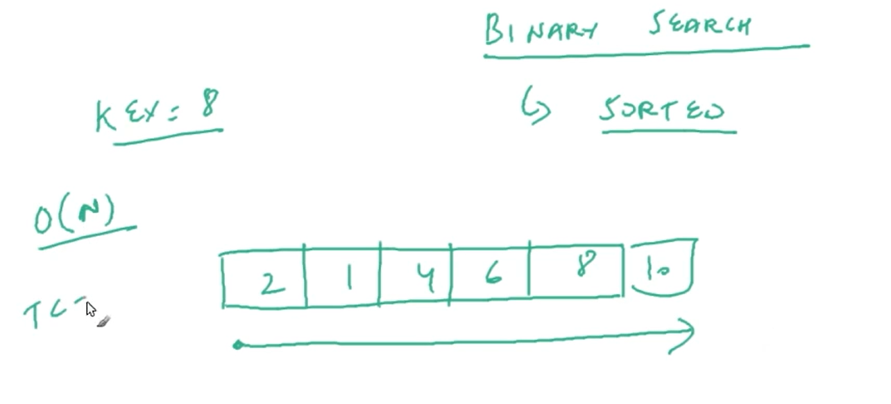
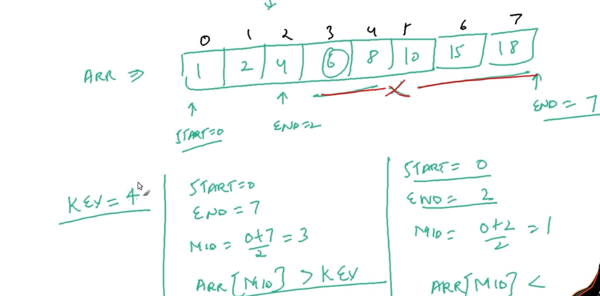

# BINARY-SEARCH-DSA

| NO.| questions                                                                                   |
| ---| --------------------------------------------------------------------------------------------------------------------------------------------------------------------------------------------------------------------------------------------------------------|
|    | **types of questions**                                                                      |
| 1  | [Introduction to Binary search](#)                                                          |
| 2  | [Binary-search-complexity](#)                                                               |
| 3  | [Binary-search-implementation](#)                                                          |                                                                                                                                                      

| 1  | [Introduction to Binary search](#)   

# 1.Binary-search

# 1.1

 Binary search and its types 

# 1.2

# 1.3

